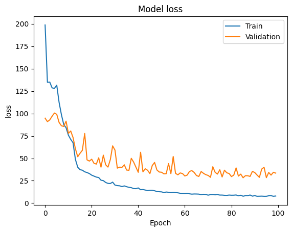
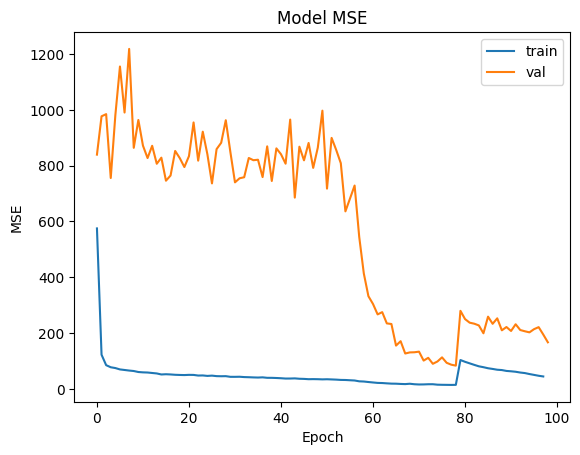
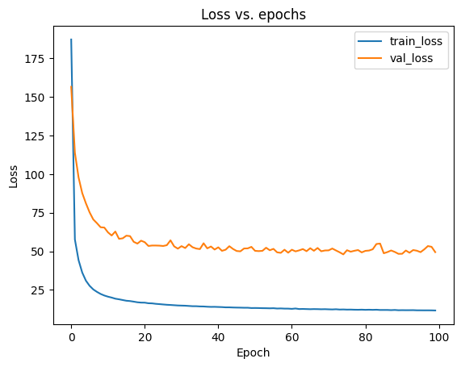

# AdCVFinal
Final project: Depth video data-enabled predictions of pig body weight using CNN and vision transformer algorithm

Project report overleaf: https://www.overleaf.com/project/6567c0e271785ae239afc022

Proposal (google drive): https://docs.google.com/document/d/108XElMGrlQYtYTRT8mrd7HrG7fTlikpgcfQGABkoiJg/edit?usp=sharing

Sample Dataset (google drive): https://drive.google.com/drive/folders/1FPcdsAfNz_j2jsIylUFv_IrGdprOQy3N?usp=drive_link


Scale-based Body Weight (google drive): https://docs.google.com/spreadsheets/d/1T70zLA8sbBlcPA5MlYOn4xg0k5J4cjU8/edit?usp=drive_link&ouid=102190712955751453390&rtpof=true&sd=true

### Simple CNN -- the model we used in 2023Spring_DL

[SimpleCNN.ipynb](https://github.com/yebigithub/AdCVFinal/blob/main/SimpleCNN/SimpleCNN.ipynb)

```
METRICS ON ENTIRE DATASET:
--------------------------
Test RMSE:	5.00520
Test R^2 Score:	0.77779
Test MAPE:	5.09345%
--------------------------
```

<p align="center">
 

### ViT--80by80
[Vit_80.ipynb](./ViT_80by80/Vit_80.ipynb)

```
METRICS ON ENTIRE DATASET:
--------------------------
Test RMSE:	6.01439
Test R^2 Score:	0.70610
Test MAPE:	5.92023%
--------------------------
```

<p align="center">
 

### ResNet50 -- with transfer learning

[ResNet50.ipynb](./ResNet50/ResNet50.ipynb)

```
METRICS ON ENTIRE DATASET:
--------------------------
Test RMSE:	4.81642
Test R^2 Score:	0.79400
Test MAPE:	4.79075%
--------------------------
```

<p align="center">
 